<p align="center">
  <a href="https://ramwisp.com"></a>
</p>

<p align="center">
  <a href="https://www.npmjs.com/package/ramwisp"></a>
  <a href="mcp/LICENSE"></a>
  <a href="LICENSE-SUL.md"></a>
  <a href="https://ramwisp.com"></a>
</p>

<p align="center">
  <b>Every Claude Code and Codex subagent gets its own sealed cloud machine</b> — with the RAM it needs,<br>
  your own subscription or API key, and an attested enclave so <b>not even we</b> can see what it does.
</p>

---

## Install

**Claude Code**

```bash
claude mcp add --scope user ramwisp -- npx -y ramwisp@latest
```

**Codex** — add to `~/.codex/config.toml`:

```toml
[mcp_servers.ramwisp]
command = "npx"
args = ["-y", "ramwisp@latest"]
tool_timeout_sec = 1000
```

**Or as a skill, no MCP** (Claude Code and Codex): installs a `SKILL.md` that teaches the agent the `ramwisp` CLI.

```bash
npx -y ramwisp@latest skill
```

The first time a tool is used, the MCP opens your browser to sign in (new accounts get free credit). Then just ask:

> *“run every package’s tests in parallel in ramwisp subagents with 8 GB and fix whatever breaks”*

## See it in action

<p align="center"></p>

**Watch it live.** Every command, tool call and message the subagent makes is encrypted for your computer
only and streamed back while it runs: `npx -y ramwisp logs <id> -f`, or launch with `ramwisp spawn … --follow`
to get the live stream and then the result from one command (the skill runs it in the background by default).

Your agent stays in your terminal. Each subagent gets a copy of your project (only what git tracks — never
`.env` or anything in `.gitignore`), works on its own machine, and sends back an answer plus a patch you
review and `git apply`. Your laptop’s RAM stays free.

## How it works

<p align="center"></p>

| | |
|---|---|
| **01 Request** | Your agent calls `spawn_agent`. The MCP packs the project and asks for one machine per subagent. |
| **02 Prove** | Each new EC2 machine boots a Nitro Enclave and returns an attestation signed by AWS hardware: the image hash (PCR0) and a fresh X25519 key. The MCP checks the chain up to the **AWS Nitro Enclaves Root G1**, the COSE signature, the nonce and the PCR0 — on your computer. |
| **03 Seal** | Only if the proof checks out: task, project and credential (access token only, never the refresh token) are encrypted with ChaCha20-Poly1305 to a key that exists only inside that enclave. |
| **04 Run** | Claude Code or Codex runs inside the enclave, in memory only. Egress is a blind TCP tunnel (TLS end to end); private and metadata IPs are blocked. |
| **05 Evaporate** | The answer and the patch come back sealed to your machine. The instance is terminated — or evaporates on its own at the time limit. |

## Privacy, in one table

| We never see | We do see (and show you in your dashboard) |
|---|---|
| the task you sent | when it started, how long it ran, what it cost |
| your Claude / ChatGPT login or API key | how much RAM it used, live |
| your code and what the agent wrote or ran | which domains it reached (names only) |
| the final answer and the patch | whether it succeeded or failed |

Accepted image hashes and the root of trust: [ramwisp.com/transparencia](https://ramwisp.com/transparencia).

## Pricing (hosted service)

You pay for the machine, per second (60 s minimum). The model runs on your own subscription or key.

| Subagent RAM | Price |
|---|---|
| up to 8 GB | $0.20 / hour |
| up to 24 GB | $0.26 / hour |

New accounts get about **15 hours of free machine time** — a 4 GB subagent, or roughly 44 runs of 20 minutes;
top up by card any time. Every subagent reserves its maximum
cost and refunds the rest, so you never go past your balance.

## Run your own instance

Free for personal use and for your organization’s internal use under the
[Sustainable Use License](LICENSE-SUL.md).

<details>
<summary><b>Self-hosting guide</b></summary>

You need an AWS account on a paid plan (Nitro Enclaves aren’t available on free-tier instance types) with the
AWS CLI configured, and a Linux server with Node.js 24, Docker, nginx and a domain with HTTPS.

```bash
git clone https://github.com/spectre-systems/ramwisp && cd ramwisp

# 1. AWS: artifact bucket, host + builder roles, security group with no inbound ports
AWS_PROFILE=myprofile infra/setup.sh > server/.env.aws

# 2. Build the enclave image on a throwaway EC2 builder (prints PCR0, adds it to mcp/pcrs.json)
AWS_PROFILE=myprofile ARTIFACT_BUCKET=<from step 1> infra/build-eif.sh

# 3. Configure and build
cp server/.env.example server/.env && cat server/.env.aws >> server/.env   # then set PUBLIC_URL etc.
(cd server && npm ci) && (cd web && npm ci && npx vite build)

# 4. Run (put nginx with TLS in front of port 4800)
cd server && node --env-file=.env src/index.ts

# 5. Point the MCP at your server
claude mcp add --scope user ramwisp -e WISP_API=https://your-domain.example -- npx -y ramwisp@latest
```

The first account created on a fresh database becomes the admin (`/admin`). Optional card top-ups: set
`STRIPE_SECRET_KEY` in `server/.env` and run `infra/stripe-setup.sh`.

**Local development without AWS:** set `LAUNCHER=local` and build the dev image
(`docker build -t wisp-enclave:dev enclave`). Each job runs the enclave as a network-less Docker container
with an emulated attestation; use `WISP_API=http://127.0.0.1:4800` and `WISP_DEV_ROOT=/tmp/wisp-dev/devroot.pem`.

</details>

<details>
<summary><b>Repository layout</b></summary>

| Path | What | License |
|---|---|---|
| `mcp/` | MCP server + CLI (`npx ramwisp`): attestation check, sealing, workspace packing | Apache-2.0 |
| `enclave/` | Enclave image and runner: NSM attestation, sealed channel, egress proxy | Apache-2.0 |
| `parent/` | Host agent on each EC2 instance: starts the enclave, relays bytes, egress filter | Sustainable Use |
| `server/` | API, accounts, credits, job queue, EC2 launcher, Stripe top-ups, admin | Sustainable Use |
| `web/` | Site and dashboard (Vite + React) | Sustainable Use |
| `infra/` | AWS setup, enclave image build, Stripe webhook setup | Sustainable Use |
| `docs/readme/` | The animations in this README (`python3 docs/readme/build.py`) | Sustainable Use |

</details>

<details>
<summary><b>Verifying the enclave image</b></summary>

`mcp/pcrs.json` lists the PCR0 values the MCP accepts. To check that a published hash corresponds to this
source, rebuild the image with `infra/build-eif.sh` at the listed commit and compare PCR0. The image pins
the versions of Claude Code, Codex and the Debian base; fully bit-for-bit reproducible builds are still being
worked on.

</details>

## Security

Please report vulnerabilities privately to Spectre Systems rather than in a public issue.

## License

- `mcp/` and `enclave/` — [Apache License 2.0](mcp/LICENSE): audit the code that verifies the enclave, rebuild the image, reuse it freely.
- Everything else — [ramwisp Sustainable Use License](LICENSE-SUL.md): free for personal and internal business use; no selling it or offering it as a service to third parties.
- Contributions — [CLA](CLA.md). “ramwisp” and its logos are trademarks of Spectre Systems.

<p align="center"><sub>Made by <a href="https://github.com/spectre-systems">Spectre Systems</a> · <a href="https://ramwisp.com">ramwisp.com</a></sub></p>
